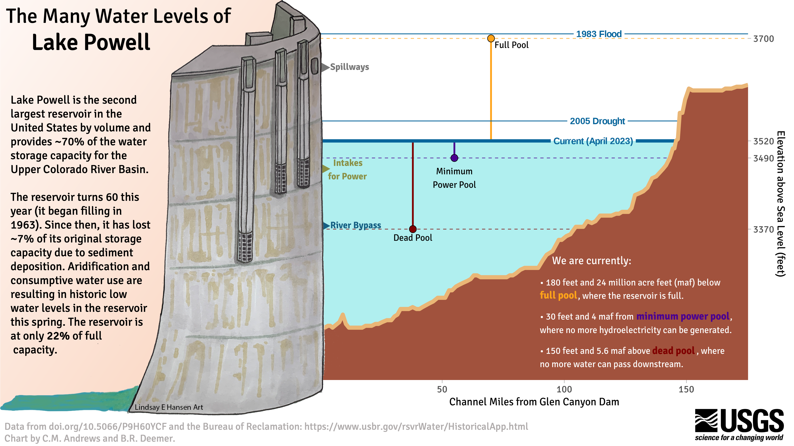

# Chart Challenge Contribution

Please fill out this information prior to creating a merge request, *unless you've filled out the template R or Python scripts*. After your merge request is approved, please make sure the image linked here is your final image in the `out/` folder (the `out/` png file itself is not committed, but the README with the linked image is). We will also ask you to share the final image in a sharepoint folder provided via gitlab.

Your name: Caitlin M Andrews

Your prompt: Anthropocene

Date for your prompt in April: 04/19/2023

Image:

Share the link in this document with the format ``:

Your key takeaways (1-2 sentences each):

1. The water levels at Lake Powell have fluctuated immensely in its sixty year history. However, due to consumptive water use and recent drought, the Lake's water level is currently the lowest we have seen since the Lake began filling in the mid 1960s.
2. Operations at the Glen Canyon Dam are tied to 'key functional elevations' of Lake Powell. For example, when the Lake drops below 'minimum power pool', hydroelectricity can no longer generated at the Dam. We are currently 30 feet away from minimum power pool.

Your data sources:
* Lake elevations from the Bureau of Reclamation: https://www.usbr.gov/rsvrWater/HistoricalApp.html
* Jones, D.K., and Root, J.C., 2021, Modified topobathymetric elevation data for Lake Powell: U.S. Geological Survey data release, https://doi.org/10.5066/P9H60YCF.

Key programs and/or packages used:
`R`, packages: `ggplot`

Overall method to create this viz:
Gathered information about key functional elevations from Bureau of Reclamation (BOR) documentation. Downloaded Lake Powell historic water levels from BOR historical app and recorded water levels for recent events as well as historic droughts and floods. Extracted bathymetric elevation of Lake Powell along the historic "center line" of the Colorado River from Jones & Root (2021). Illustration by Linsday Hansen, employee at Southwest Biological Science Center.